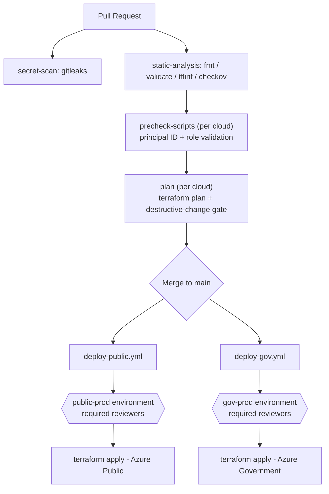

# Architecture

## Why this repo is structured this way

Azure Lighthouse grants one tenant standing, cross-tenant access to another
tenant's resources. Automating it means automating a control that can widen
or sever a trust relationship with no interaction from the customer side.
Every design choice here optimizes for **making that change visible and
reversible before it happens**, not just for DRY Terraform.

## Pipeline flow

Every Azure-touching step in this pipeline authenticates via a **different**
OIDC federated credential scoped to its own subject (`pull_request` for the
read-only precheck, `environment:public-prod` / `environment:gov-prod` for
the actual applies) - so no single leaked token grants both read and write,
or access to both clouds.

## Dual-cloud model

Azure Public and Azure Government are separate clouds with separate AAD
tenants, separate ARM endpoints, and separate resource namespaces. This repo
treats them as two independent deployment targets sharing one codebase:

- One root module (`main.tf` + `modules/lighthouse-delegation`), reused for both.
- Two tfvars files (`environments/public`, `environments/gov`) supplying the
  cloud-specific scope, tenant, and authorizations.
- Two backend configs (`backend-config/*.hcl`), because Terraform state
  storage cannot be shared across clouds.
- Two GitHub Environments (`public-prod`, `gov-prod`), each with its own
  federated OIDC credential, so a compromised or misconfigured Gov
  credential can never be exchanged from a Public-cloud run and vice versa.

## Precheck gate (required, not optional)

`precheck.yml` runs on every PR and is a **required status check** (set this
in branch protection after the first push). It:

1. Lints and statically scans the Terraform (`fmt`, `validate`, `tflint`, `tfsec`).
2. Authenticates read-only to both clouds and validates that every
   `principal_id` in both tfvars files resolves to a real AAD object.
3. Rejects high-privilege role definitions (Owner, User Access
   Administrator, RBAC Administrator) unless explicitly allow-listed.
4. Runs a full `terraform plan` for both clouds and fails the build if the
   plan would delete or replace an existing Lighthouse definition or
   assignment - unless the PR carries the `lighthouse-destructive-override`
   label, which should itself require an additional reviewer.

## Deploy gate

`deploy-public.yml` and `deploy-gov.yml` trigger only on push to `main`
(i.e., after PR review + required checks have passed) and each call the
shared `deploy.yml` reusable workflow with a different `cloud` and
`environment_name`. The GitHub Environment is what enforces required
reviewers at apply time and scopes the OIDC federated credential - treat
adding or changing environment protection rules as itself a change that
needs review.

## Things intentionally left as manual setup (not in Terraform)

- The two state-storage accounts (`backend-config/*.hcl`) and their
  containers - bootstrapping state storage from the pipeline that reads
  that same state is a chicken-and-egg problem better solved once, by hand
  or via a separate bootstrap script, than automated.
- The two App Registrations / federated credentials per cloud, and the two
  GitHub Environments with their protection rules - these are the actual
  trust boundary of this whole system and are worth creating deliberately
  through the Azure/GitHub UI rather than via a script that could
  itself be a supply-chain target.
